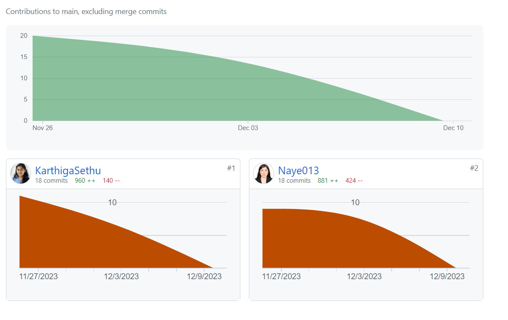
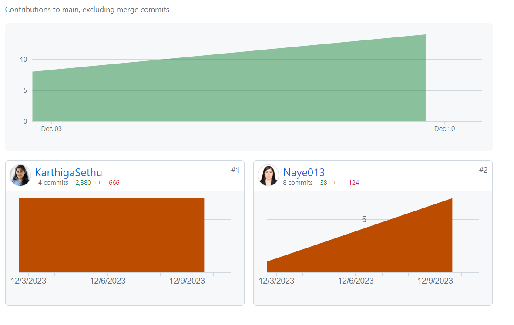
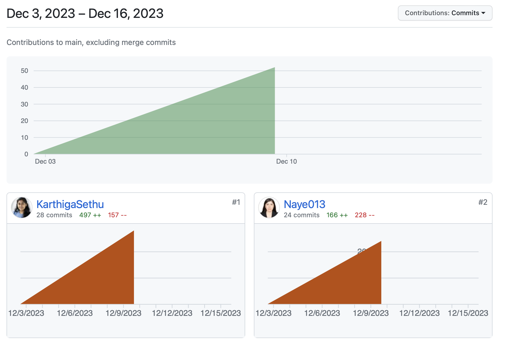

# Contribution

### Step 1- Initial Project Development

### Step 2- Testing and Exception Handling

<mark>Please ignore the first 1277 lines of code as it is from previous repository.<mark>

### Step 3- Initial Project Development

<mark>Ignore the middle 10 commits of Karthiga as it just dummy check to check git hub actions
Nayeli tried to publish the package, created the video, import batch in readme.</mark>

